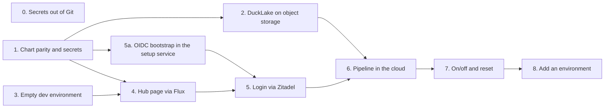

# SRDP on Scaleway

This plan brings the SRDP stack to Scaleway Kapsule as a single dev environment.
It builds on the hub-and-spoke blueprint in `deploy/scaleway/`.
The direction comes from [SRDP status and vision](../../20260906_srdp-status-and-vision.md), which takes precedence.

If you have no Kubernetes experience yet, read the [Kubernetes primer](kubernetes-primer.md) first.
Each ticket links to it whenever a new concept comes up.

## Goal

We want a basic SRDP setup running on Kubernetes in the cloud, on which we can build data pipelines.
Today we can only show customers the design.
With this environment we can show them a working proof of concept.

## Decisions

| Topic | Decision |
|:---|:---|
| Infrastructure | The hub-and-spoke blueprint in `deploy/scaleway/`. We no longer extend the older stack in `deploy/opentofu/scaleway`. |
| Environments | A hub plus `dev` only. Ticket 8 describes how to add an environment later. |
| Deploy | Flux pulls the SRDP chart from Git and installs it (GitOps). This resolves issue #38. |
| Postgres | Postgres runs inside the cluster. Scaleway's managed database goes behind a toggle and stays off. |
| Network | The mesh (Headscale, mesh router and Public Gateway) goes behind a toggle and stays off. The Kubernetes API is only reachable from our own IP. |
| Secrets | Secrets live only in Scaleway Secret Manager and reach the cluster through External Secrets. No secrets are stored in Git. |
| Domain | We use `nip.io` on the load balancer IP as an interim step. |
| Budget | At most €100 per month, and preferably as little as possible. |
| On/off | The environment is switched off when nobody uses it. A documented procedure switches it on and off. |
| Data | CBS sample data only, for now. |
| Nodes | The system pool starts with one node of about 8 GB. The compute pool for Dagster runs scales to zero. |

### Assumptions

These points were proposed during the design and have not been explicitly confirmed yet.
Challenge them before you start on the ticket they affect.

- Switching off means the node pools go to zero. The cluster, the volumes, the bucket and the IP stay, so the data is kept.
- Tearing everything down is a separate reset, which also deletes the files in the bucket, so the catalog and the storage never drift apart.
- The Zitadel OIDC app is created automatically.
- Dagster runs at most one run at a time, until we know whether DuckLake handles several concurrent writers.
- The stack must run fully in kind before we move to the cloud.

## Costs

These are rough prices that have not been checked against Scaleway's current price list.
Ticket 3 measures the real costs.

| Component | On (€/month) | Off (€/month) |
|:---|:---|:---|
| Kapsule control plane (shared tier) | 0 | 0 |
| System pool, one node of about 8 GB | 20 to 30 | 0 |
| Compute pool, only during runs | 0 to 10 | 0 |
| Load balancer | about 10 | about 10 |
| Block storage for Postgres and Zitadel | 1 to 2 | 1 to 2 |
| Object storage, registry and Secret Manager | less than 5 | less than 5 |
| **Total** | **about 35 to 55** | **about 15** |

## Tickets and order

Each ticket is a vertical slice.
That means every ticket cuts through all layers and delivers something you can show or test.
This way problems surface early instead of at the very end.



| Ticket | Blocked by | Delivers |
|:---|:---|:---|
| [0. Secrets out of Git](tickets/00-secrets-out-of-git.md) | Nothing | No working secret in tracked files outside the chart, exposed secrets rotated, and gitleaks catches new ones. |
| [1. Chart parity and external secrets](tickets/01-chart-parity-and-secrets.md) | Nothing | The full stack runs in kind, with secrets coming from outside the chart. |
| [2. DuckLake on object storage](tickets/02-ducklake-object-storage.md) | 1 | DuckLake writes and reads through S3 with separate reader and writer keys, proven locally. |
| [3. A lean, empty dev environment](tickets/03-empty-dev-environment.md) | Nothing | An empty, low-cost environment on Scaleway where `kubectl` works. |
| [4. The hub page live via Flux](tickets/04-hub-page-via-flux.md) | 1, 3 | The hub page is online with a real certificate. |
| [5a. OIDC bootstrap in the setup service](tickets/05a-setup-service-oidc-bootstrap.md) | 1, and #64 | The setup service from #60 creates the OIDC app in Compose and kind, replacing `provision-oidc.sh`. |
| [5. Login via Zitadel](tickets/05-login-via-zitadel.md) | 4, 5a | All apps are online behind the login. |
| [6. A pipeline in the cloud](tickets/06-pipeline-in-the-cloud.md) | 2, 5 | A Dagster run writes to the bucket, and the apps read it back. |
| [7. On/off and reset](tickets/07-on-off-and-reset.md) | 6 | Commands and a runbook to switch the environment on and off. |
| [8. Add an environment](tickets/08-add-an-environment.md) | 7 | A tested checklist for stage or prod. |

Tickets 0, 1 and 3 can start at the same time.
Ticket 0 handles every secret outside the Helm chart, and PR 1b of ticket 1 handles the chart itself.
Issue #60 is leading for the setup service and issue #56 for the S3 backend, so tickets 1, 2, 5a and 5 follow their design.
Keep in mind that ticket 3 starts costing money as soon as the cluster exists, even when it is switched off.

## Reviews and PRs

The work is split into small PRs, so that each one takes about half an hour to review.
Each ticket lists its PRs in a "PRs" section, together with what the reviewer should focus on.

### Principles

- **One topic per PR.** A PR changes Python code, the chart, Terraform or GitOps, and rarely more than one of those at once.
- **Every PR leaves `main` working.** New functionality is off by default, for example `DUCKLAKE_STORAGE_BACKEND=local` or a toggle set to `true`, so a merge breaks nothing that exists.
- **Evidence in the description.** Every PR shows that it works. For code that means tests, for the chart the output of `helm template`, for Terraform the output of `plan`, and for the cloud the output of `kubectl get pods` or a screenshot.
- **Keep it small.** The guideline is at most about 400 changed lines, excluding lockfiles and generated files. Split a PR that grows beyond that.
- **Link to the ticket.** The description starts with a link to the ticket file, so the reviewer can read the reasoning.

### A merge to main is a deploy

From ticket 4 onwards Flux reads the `main` branch.
A PR that changes anything in `deploy/gitops/` is therefore rolled out as soon as it is merged.
Treat those PRs as deploys.
Only merge them when you have time to check that it works, and state in the description how to roll back (revert the PR).

Terraform changes are not rolled out automatically.
After the merge you run `apply` yourself and paste the output as a comment on the PR.

### Base branch

The Compose stack this plan builds on still lives on the `poc/dbt-lineage-marquez-hub` branch.
It must reach `main` first, otherwise colleagues review the entire POC with every PR.
So first open a PR from that branch to `main`, or split it if it is too large for one review.
After that, every PR in this plan starts from `main`.

### PR description

Use these four headings in every PR.

```markdown
## Ticket
Link to docs/scaleway-deployment/tickets/<nn>-<name>.md

## What changes
Two or three sentences.

## How it was tested
Commands and output, or a screenshot.

## What the reviewer should focus on
The places where a mistake does the most damage.
```

### Overview

| PR | Ticket | Topic | Blocked by |
|:---|:---|:---|:---|
| 0 | | This plan (docs) | |
| 1a | 1 | Chart matches Compose | |
| 1b | 1 | Secrets and registry from outside the chart | 1a |
| 2a | 2 | `S3StorageBackend` with tests, off by default | |
| 2b | 2 | Wire Compose, MinIO, dbt and the chart to S3 | 1b, 2a |
| 3a | 3 | Toggles in the blueprint | |
| 3b | 3 | Dev settings and first apply | 3a |
| 4a | 4 | Build and push images to the hub registry | 1b, 3b |
| 4b | 4 | External Secrets and a HelmRelease with only the hub | 4a |
| 5a | 5 | Generic OIDC script | |
| 5b | 5 | Enable Zitadel, oauth2-proxy and the apps | 4b, 5a |
| 6 | 6 | DuckLake in the cloud writing to the bucket | 2b, 5b |
| 7a | 7 | `dev-off`, `dev-on` and `dev-reset` | 6 |
| 7b | 7 | Runbook and vision doc | 7a |
| 8 | 8 | Checklist for a new environment | 7b |

PRs without blockers can be open at the same time.
That way 1a, 2a, 3a and 5a can be reviewed in parallel from the start.

## Out of scope

- **Customer data.** Before that, the mesh and the managed database must be on, the JWT validation from ADR-0008 and the project RBAC from ADR-0005 must exist, and the baseline audit must pass. That becomes its own epic.
- **A real domain.** A subdomain of an existing domain will replace `nip.io` later.
- **DuckLake with several writers.** An investigation must show whether several concurrent runs are safe.
- **The old stack.** We remove `deploy/opentofu/scaleway` and the `just prod-*` recipes once dev runs on the blueprint.
- **Ownership of the blueprint.** The agreement with Andrea about fixes in the modules is still open.
- **Committed development secrets.** The local passwords in the git history get their own rotation ticket.
